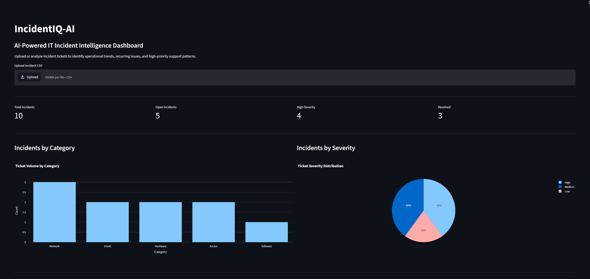
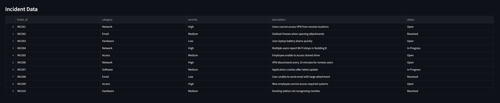
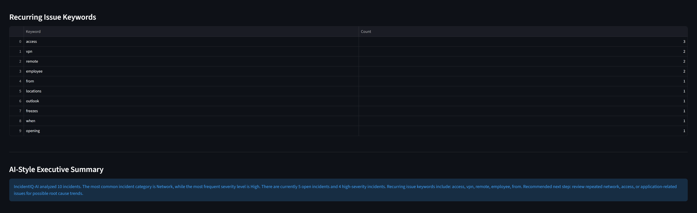

# IncidentIQ-AI

AI-powered IT incident intelligence dashboard for analyzing operational trends, recurring issues, and support ticket patterns.

---

## Features

- Incident ticket ingestion
- Dashboard analytics
- Severity and category filtering
- Search functionality
- Recurring keyword detection
- AI-style operational summaries
- Action recommendations

---

## Tech Stack

- Python
- Streamlit
- Pandas
- Plotly
- Scikit-learn

---

## Dashboard Preview

### Main Dashboard



---

### Incident Table



---

### Keyword Analysis



---

## Project Structure

```text
IncidentIQ-AI/
├── app.py
├── data/
├── screenshots/
├── src/
├── requirements.txt
└── README.md
```

---

## Getting Started

Clone the repository:

```bash
git clone git@github.com:phredogee/IncidentIQ-AI.git
cd IncidentIQ-AI
```

Install dependencies:

```bash
pip install -r requirements.txt
```

Run the dashboard:

```bash
streamlit run app.py
```

---

## Current Status

MVP version in active development.

Planned upgrades:
- semantic similarity search
- AI-powered incident clustering
- severity prediction
- vector embeddings
- Docker deployment
- live cloud hosting

---

## Business Value

IncidentIQ-AI demonstrates how AI and analytics can improve IT operations by identifying recurring problems, reducing incident response time, and surfacing operational trends.
